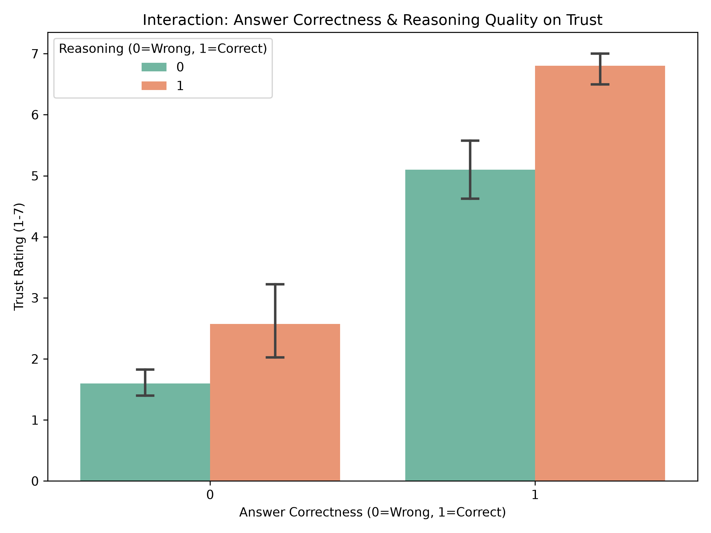
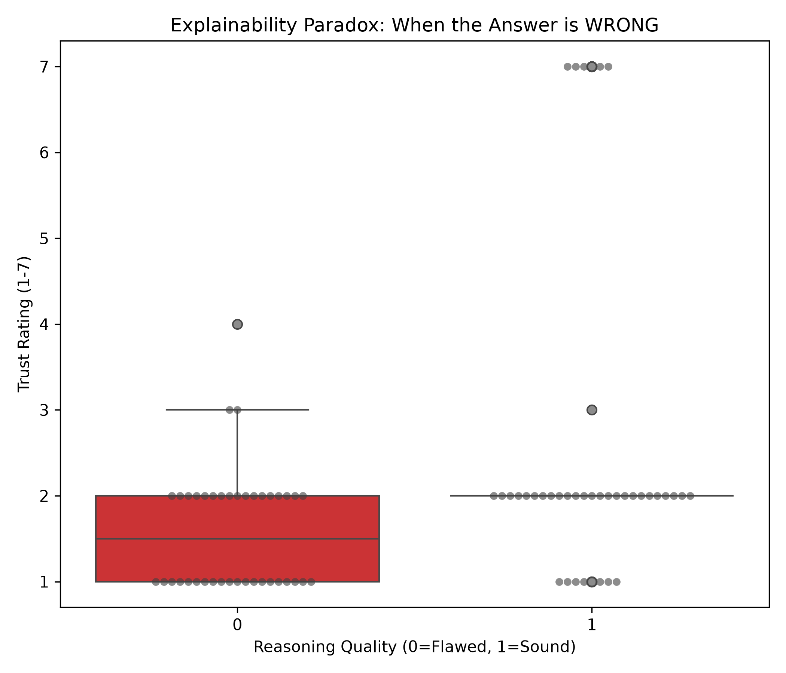
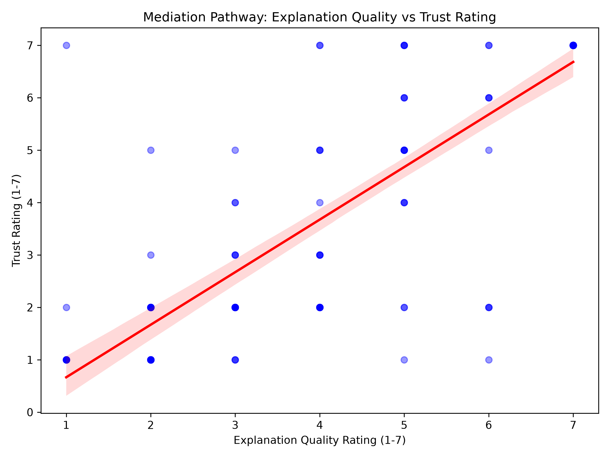

# The Explainability Paradox: Does Reasoning Chain Increase Trust Even When Wrong?

## Abstract
This experiment investigates the relationship between the correctness of an artificial intelligence model's final mathematical answer and the quality of its underlying reasoning chain. Specifically, the study examines how these two variables independently and interactively influence simulated human trust. The primary objective is to empirically test the "Explainability Paradox": the hypothesis that a highly transparent, logically structured explanation can preserve user trust in a model even if the final provided answer is fundamentally incorrect.

## Methodology

### Experimental Design
The study employs a 2x2 within-subjects experimental design. The design manipulates two primary independent variables to observe their effects on user trust:
* **Answer Correctness**: The final mathematical solution provided (Correct vs. Incorrect).
* **Reasoning Quality**: The logical validity and soundness of the step-by-step reasoning chain preceding the answer (Correct vs. Incorrect logic).

This factorial design yields four distinct experimental conditions per problem:
1. Correct Answer + Correct Reasoning
2. Correct Answer + Flawed Reasoning
3. Incorrect Answer + Correct Reasoning
4. Incorrect Answer + Flawed Reasoning

### Procedure and Evaluation
For each mathematical problem within the dataset, the four variants are computationally generated using large language models instructed via targeted prompts to simulate specific cognitive or mathematical errors. 

Following generation, the variants are subjected to a blind evaluation by simulated human personas acting as independent judges. To account for varying levels of domain expertise and skepticism, four distinct personas are utilized (Math Teacher, Data Scientist, Policy Maker, General User). Each judge evaluates the variants on a 1-7 Likert scale across two dimensions:
* **Trust (Dependent Variable)**: The degree of confidence the evaluator places in the model's final output.
* **Explanation Quality (Mediator)**: The perceived clarity, coherence, and linguistic persuasiveness of the reasoning chain.

### Computational Pipeline
The execution of this methodology is orchestrated through the following modular components:
* `data.py`: Manages the loading of raw mathematical problems and coordinates the sequential generation and evaluation phases.
* `agents.py`: Executes interactions with large language model application programming interfaces (Qwen, Cerebras), manages rate limits, and parses simulated reasoning outputs.
* `main.py`: Serves as the primary execution script for running the experimental conditions across designated model architectures.
* `analysis.py`: Conducts the statistical analyses, including Analysis of Variance (ANOVA), Multiple Regression, and Mediation Analysis.
* `results/`: Archives the generated reasoning chains and subsequent evaluation metrics.
* `analysis/`: Archives statistical reports and quantitative visualizations.


# Results (GLM-4.7 Analysis)

We analyzed the evaluation results for the `zai-glm-4.7` model using a 2x2 within-subjects ANOVA, multiple regression, and mediation analysis on 160 evaluation trials (10 problems × 4 conditions × 4 judge personas).

### Descriptive Statistics
The table below summarizes the mean ratings for Trust and Explanation Quality (each rated on a 1–7 Likert scale) across the four experimental conditions:

| Experimental Condition | Answer Correctness | Reasoning Quality | Mean Trust Rating | Mean Explanation Quality |
| :--- | :---: | :---: | :---: | :---: |
| **Flawed & Incorrect** | Incorrect (0) | Flawed (0) | **1.600** | **2.775** |
| **Explainability Paradox** | Incorrect (0) | Sound (1) | **2.575** | **3.225** |
| **Deceptive Soundness** | Correct (1) | Flawed (0) | **5.100** | **4.650** |
| **Fully Correct** | Correct (1) | Sound (1) | **6.800** | **6.725** |

---

### Key Statistical Results

#### 1. 2x2 Within-Subjects ANOVA (Dependent Variable: Trust Rating)
* **Answer Correctness (Main Effect)**: Has a dominant and highly significant main effect on trust ($F(1, 9) = 117.25$, $p < 0.00001$, generalized eta-squared $\eta_g^2 = 0.817$). Correctness of the final answer accounts for the vast majority of the variance in trust.
* **Reasoning Quality (Main Effect)**: Has a significant main effect on trust ($F(1, 9) = 13.415$, $p \approx 0.0052$, $\eta_g^2 = 0.349$). 
* **Interaction Effect (Correctness × Reasoning)**: The interaction is not statistically significant ($F(1, 9) = 3.250$, $p \approx 0.1049$, $\eta_g^2 = 0.038$). The benefit of sound reasoning is present in both correct and incorrect answer conditions.


*Figure 1: Mean trust ratings across experimental conditions. Correct answers (right bar pair) receive substantially higher trust than incorrect answers (left bar pair). Sound reasoning (green bars) consistently boosts trust compared to flawed reasoning (orange bars) in both cases.*

#### 2. The Explainability Paradox
The "Explainability Paradox" posits that a transparent, logical explanation can maintain user trust even if the final answer is wrong.
* **Findings**: Under incorrect answer conditions, upgrading reasoning from flawed to sound increases the mean trust rating from **1.600** to **2.575** (a mean difference of **+0.975**).
* **Effect Size**: This represents a moderate-to-large effect size (Cohen's $d = 0.670$). Providing logical, step-by-step reasoning acts as a trust-recovery mechanism even when the final answer is incorrect.


*Figure 2: Distribution of trust ratings when the final answer is incorrect. Sound reasoning (1) shifts the overall distribution of trust ratings upwards compared to flawed reasoning (0), illustrating the trust-cushioning effect of the Explainability Paradox.*

#### 3. Multiple Regression (Comparative Influence)
To compare the relative predictive weight of correctness versus reasoning quality on trust, we evaluated standardized regression coefficients:
* **Answer Correctness Standardized Beta ($\beta$)**: **0.781** ($p < 0.0001$)
* **Reasoning Quality Standardized Beta ($\beta$)**: **0.270** ($p < 0.0001$)

**Key Finding**: Answer correctness has a **nearly 3x stronger predictive effect** on trust compared to reasoning quality. Correctness is the primary driver of trust, while reasoning quality serves as a secondary modulator.

#### 4. Mediation Analysis (Reasoning Quality → Explanation Quality → Trust)
We tested whether the effect of reasoning quality (X) on trust (Y) is mediated by the perceived quality of the explanation (M):
* **Path $X \rightarrow M$**: Significant ($\beta = 1.263$, $p < 0.001$)
* **Path $M \rightarrow Y$**: Significant ($\beta = 1.003$, $p < 0.001$)
* **Direct Effect ($X \rightarrow Y$)**: Not significant ($\beta = 0.079$, $p = 0.718$)
* **Indirect Effect ($X \rightarrow M \rightarrow Y$)**: Significant ($\beta = 1.259$, bootstrap $p = 0.0$, 95% CI $[0.636, 1.918]$)

**Key Finding**: There is **full mediation**. The logical soundness of the reasoning chain does not directly change trust; it influences trust entirely through its impact on the perceived quality of the explanation.


*Figure 3: Linear relationship between explanation quality and trust rating. The strong correlation highlights how explanation quality directly mediates user trust, serving as the interface through which reasoning soundness is perceived.*

---

### Conclusion: What the GLM Results Reflect
The GLM analysis exposes critical insights into the dynamics of human-AI trust:
1. **Outcome Bias / Primacy of Correctness**: Users prioritize accuracy. A correct answer with flawed logic (trust = 5.100) is trusted significantly more than an incorrect answer with sound logic (trust = 2.575). Explanations are not a substitute for correctness.
2. **Trust Cushioning (The Paradox)**: If an error is made, a logical and sound reasoning chain helps cushion the drop in trust, recovering nearly 1 full point on a 7-point scale.
3. **The Persuasion Vulnerability**: Because trust is fully mediated by the *perceived quality of the explanation* (rather than direct verification of correctness), a highly articulate, persuasive reasoning chain can lead users to over-trust incorrect answers. This highlights a significant safety and reliability concern for conversational agents.


## Replication Instructions
To replicate the experiment, install the necessary dependencies:
```bash
pip install openai pandas scipy statsmodels matplotlib seaborn python-dotenv
```

Configure the environment variables within a `.env` file:
```env
GROQ_API_KEY_1=your_key
CEREBRAS_API_KEY_1=your_key
CEREBRAS_MODEL_NAME="zai-glm-4.7"
GROQ_MODEL_NAME="qwen/qwen3.6-27b"
```

Execute the primary script to initiate the data generation and evaluation pipeline:
```bash
python main.py --qwen
python main.py --glm
```
